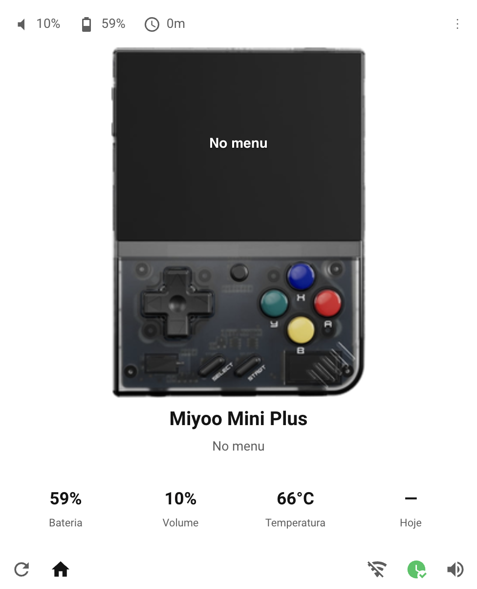

# miyoo-mini-card

Home Assistant Lovelace card for the **Miyoo Mini Plus** running
[OnionOS](https://onionui.github.io/), paired with
[`miyoo-mqtt-reporter`](https://github.com/hudsonbrendon/miyoo-mqtt-reporter).

Shows the real device photo with the currently running game overlaid on the
screen, a state line, and a 4-cell stat grid (battery / volume / temperature
/ playtime today by default — fully configurable). Live state indicators
(WiFi / NTP / mute) sit in a bottom action bar.

<p align="center">
  
</p>

## Requirements

1. The companion daemon installed and publishing — see
   [miyoo-mqtt-reporter README](https://github.com/hudsonbrendon/miyoo-mqtt-reporter#readme).
2. Home Assistant **2024.1.0+** with the MQTT integration configured against
   the same broker the Miyoo publishes to.
3. After the daemon runs once, HA Discovery auto-creates 73 entities under
   the device `Miyoo Mini Plus (<device_id>)`.

## Installation

### HACS (recommended)

1. HACS → Frontend → **⋮ Custom repositories**
2. Repository: `https://github.com/hudsonbrendon/miyoo-mini-card`, Category: **Lovelace**
3. Install → Reload your browser cache (Ctrl+F5)

### Manual

1. Download `miyoo-mini-card.js` from the
   [latest release](https://github.com/hudsonbrendon/miyoo-mini-card/releases/latest)
2. Copy it into `<config>/www/`
3. Settings → Dashboards → ⋮ → **Resources** → Add resource:
   `URL: /local/miyoo-mini-card.js`, Type: **JavaScript Module**

## Usage

Minimum config — provide the device id prefix that HA derived from the
`DEVICE_ID` field in `mqtt.conf` (default `miyoominiplus`). The card auto-
resolves all entity ids by suffix:

```yaml
type: custom:miyoo-mini-card
entity: miyoo_mini_plus_miyoominiplus
name: My Miyoo
```

### Full config

```yaml
type: custom:miyoo-mini-card
entity: miyoo_mini_plus_miyoominiplus
name: Hudson's Miyoo
language: pt-BR          # en | pt-BR (default: HA language)
stats:                   # up to 4
  - entity: battery
    unit: "%"
    subtitle: stat.battery
  - entity: volume
    unit: "%"
    subtitle: stat.volume
  - entity: temperature
    unit: "°C"
    subtitle: stat.temperature
  - entity: playtime_today_min
    suffix: " min"
    subtitle: stat.playtime_today
# Optional per-entity overrides — only set these if HA renamed something
# in your install. The auto-prefix above already produces
# `sensor.<prefix>_miyoo_<key>`, matching the names MQTT Discovery creates.
# entities:
#   battery: sensor.custom_battery_id
```

### Stat entities supported

`battery, volume, brightness, temperature, wifi_rssi, ram, cpu,
playtime_today_min, playtime_total_hours, uptime, mode, game, core,
last_played, most_played, charging_source, vbat, ibat`.

The `stats[].entity` field accepts either one of the keys above (resolved
via the prefix) or a full entity id.

## Development

```bash
npm install
npm test         # vitest
npm run lint
npm run typecheck
npm run build    # dist/miyoo-mini-card.js
```

## License

MIT — see [LICENSE](LICENSE).
